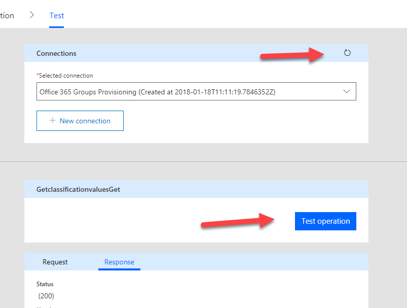

# Cumulus Monads 

# 1       Architecture

## 1.1       Azure Functions

Puzzlepart's recommended approach is to run Azure Functions on a consumption plan where you are billed per each run of a function. The price per run is very low and as creating new Office 365 Groups is not a frequent operation the run cost per month on a consumption plan is fairly low.

When running on the consumption plan each Azure function can use a maximum of 5 minutes per operation. In our modularized approach to provisioning and configuring Office 365 Groups this fits very well and is not a blocking limit.

## 1.2       Programming language and API's

Azure Functions can be written in numerous programming languages. We have chosen C# to utilize SharePoint PnP for SharePoint communication and use of the Microsoft Graph .Net SDK for Microsoft Graph communication.

In order to effectively consume Azure Functions in Microsoft Flow you need to generate a swagger definition which declaratively describes the function API. By default the swagger generation in Azure is lacking and by using C# we can automatically generate the swagger definition. This means there is no manual work as new functions are added.

## 1.3       ADAL application

Azure Functions communicate with Office 365 thru two API's. SharePoint CSOM and Microsoft Graph REST. In order to call these API's you have to establish an ADAL application which provides the necessary access rights with app-only permissions.

In addition to an ADAL app key/secret pair you have to add a certificate for access to SharePoint. The recommended practice is to set the key to never expire and set the certificate to expire in 20 years. You should also establish procedures for potentially changing the key and certificate on a schedule.

# 2       Setup

## 2.1       ADAL Application

An ADAL application is created under the Azure Active Directory blade in the Azure portal.

### 2.1.1       Setup

**Name:** &lt;give the app a senible name&gt; 
**Application Type:** Web app / API 
**Sign-on URL:** https://&lt;tenant&gt;.sharepoint.com/provisioning (or another fqdn).

#### Application permissions

Add the minimum of application-only permissions to the ADAL app. If you want to configure other resources for the Office 365 Group during provisioning you have to add the additional applicable permissions.

| API                          | Permissions                              |
| ---------------------------- | ---------------------------------------- |
| Microsoft Graph              | Directory.ReadWrite.All  Group.ReadWrite.All |
| Office 365 SharePoint Online | Sites.FullControl.All                    |

**Note:** After saving the set permissions it's important to click the *Grant Permissions* button to make them available.

### 2.1.2       Secrets / Keys

To use the ADAL app you need to generate a key which is the password for the application. Once you save make sure to copy the generated value as this is the only time you will see this. (ADAL keys are often called app secrets.)

Depending on how you manage the ADAL app over time, pick an expiration date for the key, or set it to never expire (recommended).

Store both the ADAL App Id and the key as you will need to add this into Azure Key Vault.

### 2.1.3       Certificate and manifest

When talking to SharePoint using CSOM it's not enough to have the AppId and AppSecret. You will also need to add a certificate to the ADAL App manifest.

As we will use base64 encoded versions of the certificate and the certificate private key, the easiest solution is to use https://github.com/formio/keycred (require npm) for certificate generation as it also outputs the modification to the ADAL App manifest.

Fill in sensible information for the certificate. The details does not really matter as this is a self-signed certificate. The important part is how many years the certificate should last. 30 (seems to be) is the maximum which the ADAL app allows. If you pick a shorter time span align it with the expiration time for the ADAL app key.

Once the certificate is generated, take the _Key Credentials_ part and add to the ADAL App manifest.

Store the private key and the certificate which will be stored in Azure Key Vault.

## 2.2       Azure Function App

Create an Azure Function App as stated in 1.1.

### 2.2.1       Application settings

Under application settings for the function app set the following application setting variables. The URI for Azure Key Vault comes from the next step.

| Name        | Value                                    |
| ----------- | ---------------------------------------- |
| KeyVaultUri | https://&lt;keyvaultname&gt;.vault.azure.net |
| ADALDomain  | &lt;tenant&gt;.onmicrosoft.com           |

### 2.2.2       Managed service identity

In order to easily communicate between Azure Key Vault and Azure Functions we utilize the feature of managed service identities. This is a service account for this one Function App, and allows ease of setup between services without having to create our own service accounts in Azure AD.

Navigate to platform feature for the Azure Function App and chose *Managed service identity*. Choose to integrate with Azure Active Directory and save. The name of the service identity will match that of the Azure Function App.

### 2.2.3       API key
Calling the Azure functions are secured using an API key. This means that without this key, any unwarranted calls will fail.

The key is needed for Microsoft Flow to communicate with the Function App, and you need to copy it for use when setting up the connection between Flow and Azure Functions later on.

You can copy the default API key from the _Application settings_ page for your Azure Function App.

### 2.2.4       Connect to a code repository

In order to get the actual functions into the Function App you have to connect the Function App to a code repository. On the _Platform features_ page click _Deployment options_.

Point to the repository where you have _Pzl.ProvisioningFunctions_, and once saved the Function App should start to fetch the code, compile and deploy it.

Once compiled you should see the functions listed in read-only mode.

## 2.3       Azure Key Vault

In order to protect the ADAL app secret and certificate Puzzlepart recommend storing these values in Azure Key Vault. This ensures that only people with access to key vault can read the values.

Once the key vault is created make a note of DNS name which is to be added to the Azure Function application settings in 2.2.1.

### 2.3.1       Access policies

Navigate to the Access policy setting for the key vault and click *Add new*. Under *Select principal* search up the name of your Azure Function App. Grant the principal  the following access and save.

| Name               | Value |
| ------------------ | ----- |
| Secret permissions | Get   |

### 2.3.2       Secrets

Add the following four secrets of type *Manual* which you created in step 2.1. AdalAppSecret is the key created for the ADAL application.

| Name                  | Value                                    |
| --------------------- | ---------------------------------------- |
| ADALAppCertificateKey | -----BEGIN RSA PRIVATE  KEY-----MIIEpAIB…. |
| ADALAppCertificate    | -----BEGIN  CERTIFICATE-----MIIDpzCCAo+gA… |
| ADALAppId             | &lt;ADAL App Id&gt;                      |
| ADALAppSecret         | tLw1bhSm….                               |

## 2.4       Custom connector for Flow
### 2.4.1       Generate Swagger definition for the Azure Function App
In the Azure Portal, navigate to the Azure Function App and select the function named _Swagger_. Click _Get function URL_ and copy the URL to the clipboard. 

Next paste the URL into a browser window.

Copy the output and save to a temporary local file named _swagger.json_.

### 2.4.2       Custom connector from the Azure Function App

Log in at https://flow.microsoft.com as the service account, navigate to the _Custom Connectors_ page, and click _Create custom connector_.

Name the connector _Office 365 Groups Provisioning_ and pick _Import an OpenAPI file_ and point to the file you just saved.

Click _Continue_ and then _Create connector_.

Next navigate to the _Test_ tab and set up the actual connection.

Type in the API key you saved from your Azure Function in 2.2.3.

Refresh the connections, pick the operation named _GetclassificationvaluesGet_ and click _Test operaion_. If evertything is set up correctly, you should get a status 200 back. If not, it's time to troubleshoot all the previous steps :)

